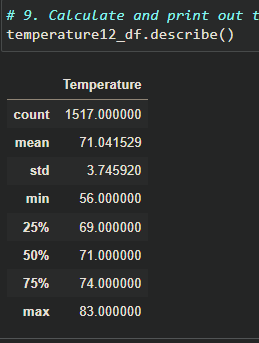

# Surfs Up Report

## Overview

the purpose of this analysis is to perform statistical analysis on monthly temperatures in Hawaii between 2010 and 2017. The temperature data is stored in a local sqlite server. The sqlalchemy package is used to extract the data; The pandas package is used to store that data into a dataframe. The temperatures in June and December are directly compared.

## Results

- The average temperature in July is about 4 degrees higher than in December.
- The temperature data for July has a slight left skew, meaning that there are outliers where the temperature was very low. The opposite is true for December.
- The IQR of the temperatures in July is smaller than the IQR of the temperatures in December, meaning there is more variance in the temperatures in December.

## Summary

